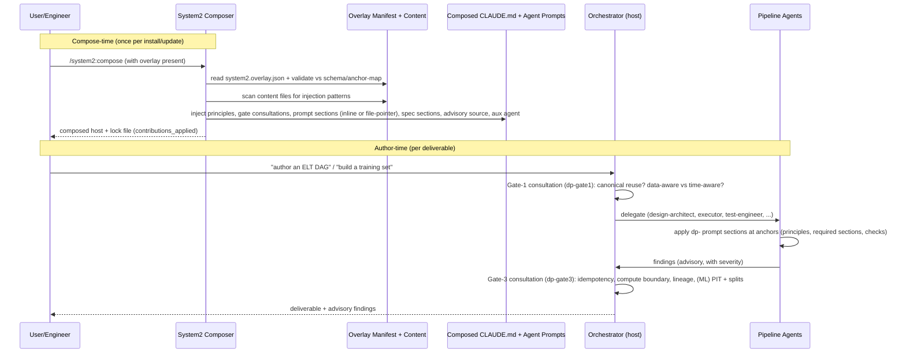

# DataPipelineOverlay — Design

> System2 Gate-3 artifact. Derived from approved `spec/context.md` (Gate-1) and
> `spec/requirements.md` (Gate-2, 41 EARS reqs), and `research/airflow-mldata-best-practices.md`.
> **Status: draft for review.**
>
> Scope reminder: the "system" being designed is **the overlay itself** — a set of additive,
> advisory contributions composed into a System2 host. It ships content + checks, **no runtime**.
> All anchor names and contribution types in this document are taken verbatim from
> `../System2/plugin/schemas/anchor-map.json` and `../System2/plugin/schemas/overlay.schema.json`
> (read 2026-06-14). No anchors are invented.

---

## Overview

DataPipelineOverlay specializes System2 for Apache Airflow data-pipeline work across two
workloads: (A) ELT/ETL DAG authoring and (B) labeled-data delivery for ML
experimentation/validation/evaluation. It is **additive-only** and **advisory-only**: it
injects orchestrator principles, Gate-1/Gate-3 consultations, per-agent prompt sections at
real anchors, required spec sections, an advisory source, and one optional auxiliary agent. It
removes and overrides nothing in base System2 (REQ-DP-001, REQ-DP-002).

The design is deliberately a **thin content overlay over a single host process**. There is no
new service, no datastore, no coordination mechanism. The "bounded contexts" in this design are
*domain language contexts encoded in guidance* (pipeline-engineering vs. ML-data delivery), not
deployment units. The overlay's only moving parts are markdown files and a JSON manifest that
the System2 composer reads at `/system2:compose` time.

Core design decisions resolved here:
- **Blocking policy (Gate-2 open question):** verification checks are **advisory/non-blocking by
  default**, but each check carries a **declared severity** (`info` / `warn` / `block-candidate`)
  in its content so a host can opt into stricter enforcement. Recommended, not final — see
  Open Design Questions. (REQ-DP-002, Error Handling)
- **OQ-6 (advisory source vs. auxiliary agent):** ship **both, minimally** — one delegation
  `advisory_source` (`dp-airflow-facts`) for inline orchestrator relay, plus one optional
  auxiliary agent (`dp-pipeline-scout`) for heavier fact-gathering. Recommended, not final.

---

## Architecture (components, responsibilities, and boundaries)

The overlay is a **manifest + content tree** mirroring `System2-OverlayTemplate`:

```
plugin/
├── .claude-plugin/plugin.json        # plugin identity (name: data-pipeline-overlay)
├── system2.overlay.json              # the manifest: all contribution declarations
├── contributions/
│   ├── orchestrator/                 # principles (3) + gate consultations (2)
│   └── agents/                       # one markdown file per (agent, anchor) contribution
├── agents/
│   └── dp-pipeline-scout.md          # optional auxiliary agent (YAML frontmatter)
└── (no hooks/ — see Rejected Abstractions)
tests/
└── test_compose_smoke.py            # tailored smoke test (mirrors template's)
```

Component responsibilities and boundaries:

| Component | Responsibility | Boundary (what it must NOT do) |
|---|---|---|
| Manifest (`system2.overlay.json`) | Declare every contribution with `dp-` IDs, anchors, summaries | No executable logic; only references content files |
| Orchestrator contributions | 3 principles + Gate-1/Gate-3 consultations injected into composed CLAUDE.md | Not re-teach System2 mechanics (REQ-DP-008) |
| Agent prompt sections | Domain guidance at real anchors for 6 pipeline agents | Only domain content; no override of base agent behavior |
| Spec required sections | Section headings the host must include in `requirements` and `design` artifacts for in-scope deliverables | Advisory; absence surfaces as a finding, not a hard gate |
| Advisory source `dp-airflow-facts` | A named source the orchestrator consults for Airflow/asset/lineage facts | Provides facts; does not author or block |
| Auxiliary agent `dp-pipeline-scout` | Optional read-only fact-gatherer for heavier Airflow/lineage lookups | `pipeline: false`; cannot spawn subagents; advisory only |
| Smoke tests | Validate manifest, IDs, anchors, summaries, dry-run compose | Test the overlay, not Airflow runtime |

**Overlay-vs-host boundary (Conformist):** the overlay is downstream of and conforms to the
System2 host contract (schema + anchor map). It never redefines host semantics (REQ-DP-001,
REQ-DP-008, Consistency & Domain Boundaries §). If the host schema/anchor map changes, the
overlay adapts; it does not patch the host.

---

## Data Flow (step-by-step)

Two flows matter: (1) **compose-time** (how the overlay enters a host) and (2) **author-time**
(how the composed guidance reaches an engineer building a DAG/dataset).



**Primary data structures (Pike Rule 5).** The overlay's data shape is intentionally trivial and
self-evident:
- *Manifest* = a typed tree of contribution records `{id, content_file, anchor, inline, summary}`.
- *Content files* = plain markdown, one per contribution, self-contained.
- *Findings* (produced by host checks the overlay defines) = `{check_id, severity, location,
  rationale, fix_hint}` — an append-only advisory list, never a blocking gate. The algorithm over
  these structures ("inject this content at this anchor"; "emit this finding") is obvious from the
  shape, so no smart control flow is needed.

---

## Public Interfaces (APIs, CLIs, schemas, config)

The overlay's only interface is its **contribution surface** into a System2 host. There is no
network API, CLI, or persistence.

### 1. Manifest contract

`plugin/system2.overlay.json` validates against `../System2/plugin/schemas/overlay.schema.json`.
Required top-level keys: `name`, `version`, `description`, `schema_version`, `contributions`.
Proposed values:
- `name`: `data-pipeline-overlay`
- `schema_version`: `1.0.0` (must match the host composer's supported version)
- `tags`: `["data-pipeline", "airflow", "ml-data", "evidence-source"]`
- `compatibility.review_when_combined_with_tags`: `["architecture-policy"]` (flags semantic
  tension when composed with DomainArch-style overlays — see Failure Modes)

### 2. Contribution-type shapes (used by this overlay)

- **Principle:** `{id, content_file, after?}` under `contributions.orchestrator.principles`.
- **Gate consultation:** `{id, content_file, phase, after?}` under
  `contributions.orchestrator.gates.<n>.consultation`; `phase ∈ {pre-delegation, post-completion}`.
- **Agent prompt section:** `{id, content_file, inline?, summary?, after?}` under
  `contributions.agents.<agent>.prompt_sections.<anchor>` (array). `summary` required when
  `inline:false` (the default).
- **Spec required section:** `{id, section_heading, description}` under
  `contributions.spec.<artifact>.required_sections`.
- **Advisory source:** `{id, name, description, resolution}` under
  `contributions.delegation.advisory_sources`; `resolution ∈ {orchestrator-relay, bash-cli, mcp}`.
- **Auxiliary agent:** `{name, role, pipeline:false, delegation_policy, agent_file}` under
  `contributions.auxiliary_agents`.

### 3. Required spec-section names (the per-deliverable contract)

Injected into the host's `requirements` and `design` artifacts (REQ-DP-007, Data & Interface
Contracts §). For shared/canonical/production deliverables:
- Scope A & cross-cutting: **Idempotency & Backfill**; **Orchestration-vs-Compute Boundary**;
  **Layered Data-Quality**; **Lineage & Provenance**.
- Scope B (ML): **Split Discipline**; **Point-in-Time Correctness**; **Eval/Golden-Set
  Definition**; **Reproducibility & Versioning**.

### 4. How checks surface findings

The overlay does not run code. It contributes *check definitions* into the host's `test-engineer`
and `code-reviewer` prompts (at `verification_workflow` / `review_criteria` anchors). Each check
definition specifies: trigger condition, what to inspect, the finding template
`{check_id, severity, location, rationale, fix_hint}`, and a declared **severity**
(`info`/`warn`/`block-candidate`). The host agent emits findings in its normal output; the
overlay adds no new reporting channel (REQ-DP-002, Observability §).

### 5. Advisory source / auxiliary agent interface

- `dp-airflow-facts` advisory source, `resolution: orchestrator-relay` — the orchestrator asks
  for facts inline (no tool/permission required). Cheapest possible mechanism.
- `dp-pipeline-scout` auxiliary agent — `Read`-only (and optionally `Bash` for `airflow`/`dbt`
  CLI version probes); `delegation_policy: orchestrator_optional`. Returns compact structured
  fact summaries; never blocks; cannot spawn subagents.

### 6. Boundary Artifact Schemas

This design also emits `spec/interfaces.json` and `spec/module-boundaries.json`. For an overlay,
"modules" are the manifest + content trees, and "public exports" are the contribution IDs and the
required-section headings (the host-visible surface). "Internal" symbols are content-file bodies,
which the host reads via summaries/file-pointers but which are not a stable API. See those files
for the machine-readable declarations.

---

## Data Model & Storage (including migrations and idempotency)

The overlay has **no runtime persistence**. Its "data model" is:
- The manifest tree (versioned in-repo, plain JSON).
- Content markdown files (versioned in-repo).
- The composer's lock file (`contributions_applied`) — owned by the host, not the overlay.

**Migrations / irreversible changes:** the overlay performs none. Compose is **idempotent**:
re-running `/system2:compose` with the same overlay version produces the same composed host
(the composer overwrites `.system2/overlays/<name>/`). Removing the overlay degrades the host to
base System2 with no residue requiring migration (REQ-DP-001, Error Handling §).

**Domain idempotency (guidance, not overlay state):** the overlay *requires authored pipelines*
to be idempotent via templated intervals + overwrite-by-partition (REQ-DP-023). This is an
engineered property of the user's pipeline, explicitly **not** derived from Airflow DAG-versioning
(REQ-DP-092). The overlay carries no notion of pipeline state itself.

---

## Concurrency, Ordering, and Consistency

The overlay introduces **no concurrency**. Compose is single-pass. Contribution ordering, where
it matters, uses the schema's `after` field (e.g., principle ordering, gate-consultation ordering).

Domain consistency (a property the *guidance* requires of authored pipelines, per Consistency &
Domain Boundaries §):
- **Context 1 (pipeline-engineering)** aggregate = a DAG + its asset/partition state + lineage;
  the overlay requires per-partition idempotent overwrite (immediate consistency within a
  run/interval).
- **Context 2 (ML-data delivery)** aggregate = a dataset deliverable + version + provenance +
  split definition; mutually consistent at delivery time.
- Between contexts: **eventual consistency** via data-aware scheduling within scheduler/watcher
  poll latency (low-latency, not instantaneous — REQ-DP-022). No stronger guarantee is designed
  because no concrete user-facing failure at v1 scale demands one.

No locks, transactions, sagas, or consensus are introduced by the overlay (Simplicity Budget §).

---

## Bounded Contexts & Context Map

The overlay encodes **two domain language contexts** (from requirements §"Consistency & Domain
Boundaries"). These are *language/model boundaries expressed in guidance content*, not services
or databases. The overlay process itself is one module; it does not split into deployable units.

| Context | Ubiquitous language | Aggregate(s) | Why a distinct boundary |
|---|---|---|---|
| **C1 Pipeline-engineering (Scope A)** | DAG, Asset/Dataset (scheduling signal), outlet, partition, interval, idempotency, parse-time, OpenLineage run/dataset | **DAG + asset/partition state + lineage** (consistency unit within a run/interval) | The word "dataset" means *a scheduling signal*; concerns are orchestration and re-run safety |
| **C2 ML-data delivery (Scope B)** | training/eval/golden set, point-in-time, split (train/val/test/holdout), skew, provenance, version | **Dataset deliverable + version + provenance + split definition** (consistent at delivery) | The word "dataset" means *a versioned artifact*; concerns are leakage, skew, reproducibility |

**Polysemy (the load-bearing reason for two contexts):** "dataset" is genuinely different across
C1 and C2 (a scheduling signal vs. a versioned artifact). The overlay deliberately keeps the two
senses distinct in guidance and does **not** force a single canonical model (REQ-DP, Consistency §;
DDD polysemy). This is a domain-driven boundary, not an infrastructure one.

**Context map relationships:**
- **C1 → C2: Customer/Supplier with a Conformist lean.** C1 (pipeline-engineering) is the upstream
  supplier; C2 (ML-data delivery) consumes delivered assets but **re-models** them as versioned
  deliverables. C2 conforms to delivered asset shapes but applies its own model on top.
- **External systems → C1/C2: Anti-Corruption Layer (advisory).** Where an external model is alien
  (OpenLineage facets, dbt/Spark engines, feature stores, registries), the overlay's guidance
  prescribes an ACL — OpenLineage emission and provenance stamping are themselves the
  normalization/ACL layer at the data boundary, owned by the consuming pipeline. The overlay names
  this pattern; it does not implement an ACL.
- **Overlay → System2 host: Conformist.** The overlay conforms entirely to the host's published
  schema and anchor map.

**Aggregate inventory:** C1 has one aggregate (DAG+state+lineage). C2 has one aggregate (deliverable
+version+provenance+splits). Two aggregates total; each is small and contention-free because the
overlay only *describes* them — it holds no instances.

**Justification for boundaries (not infrastructure-driven):** the boundary exists because the
ubiquitous language changes (the "dataset" polysemy) and because the aggregate lifecycles differ
(a DAG run/interval vs. a versioned delivery). No shared database exists between them — they are
guidance namespaces, not stores.

---

## Communication Topology

Between the two domain contexts the only "message" is a **data-aware asset update** flowing C1→C2,
observed via Airflow scheduling — this is a property of *authored pipelines*, not of the overlay.
The overlay's recommended pattern: asynchronous, message-driven (asset update as the published
signal), eventual consistency, poll-latency bounded (REQ-DP-021/022).

- **Message pattern:** producer `outlets=[Asset]` → consumer `schedule=[Asset]` (Airflow 3);
  Datasets equivalent on 2.x; watchers for event-driven on 3.x only (REQ-DP-009/022).
- **Consistency per aggregate boundary:** immediate within an aggregate (per-partition overwrite,
  per-delivery provenance); eventual across the C1→C2 boundary.
- **Back-pressure:** **not designed.** Per requirements §Performance, the overlay is not an
  event-processing system; authored-pipeline message rates at v1 scale are far below the 100/sec
  threshold that would justify explicit back-pressure. Deferred to per-pipeline design.
- **Failure isolation per context:** each context's guidance fails independently — if ML guidance
  is irrelevant (Scope A only), C1 guidance still applies. The overlay's own failure isolation:
  if it fails to compose, the host degrades to base System2 (Error Handling §).
- **Synchronous coupling justification:** the only synchronous step is the orchestrator consulting
  `dp-airflow-facts` via `orchestrator-relay` during delegation. This is justified because it is a
  cheap, in-context fact lookup on the author-time critical path; making it async would add a
  coordination mechanism for no benefit. The optional `dp-pipeline-scout` is the async/offloaded
  alternative when the lookup is heavy.

---

## Failure Modes & Recovery

These cover both the overlay's own failure behavior and the failure properties its guidance
requires of authored pipelines.

### Overlay self-failure

| Failure | Detection | Recovery / Mitigation |
|---|---|---|
| **Anchor drift** — host renames/removes an anchor across System2 versions | Smoke test `test_full_anchor_coverage`-style assertions fail; compose validation errors | Pin `schema_version`; smoke-test against the target host before release; on drift, update the manifest's anchor keys. The composer rejects invalid anchors, so drift fails loud, not silent. |
| **Schema-version mismatch** | Composer refuses unsupported `schema_version` | Bump overlay to match host; documented in rollout. Host stays usable on base System2 meanwhile. |
| **Overlay fails to compose** | Compose returns errors / non-zero | Host degrades to base System2 (additive/advisory → absence is safe, REQ-DP-001/002). No partial corruption because the composer writes atomically per its own contract. |
| **Summary-vs-content drift** (REQ-DP-003) | Summary-vs-content review; smoke check that every non-inline section has a summary | Manual diff in validation plan; treat as release-blocking for the overlay's own CI. |
| **Injection pattern in content** | Composer `_scan_for_injection`; `test_no_injection_patterns_in_content` | Author content avoiding flagged patterns; CI gate. |
| **Overlay conflict** (e.g., DomainArch overlay also targets `design_constraints`) | `compatibility.review_when_combined_with_tags` emits a semantic-tension warning at compose | Contributions are additive (appended at the anchor), so both apply; document tested-with combos; resolve genuine contradictions by content scoping (DataPipelineOverlay speaks only domain specifics, never general architecture — REQ-DP-008). |
| **Over-prescription / ceremony theatre** (R1) | Blast-radius walkthrough (REQ-DP-006/007/095) | Tiered guidance: throwaway → lightweight only; canonical/production → full sections. Encoded in content, asserted by walkthrough. |
| **Stale tool guidance** (R3) | Periodic content review; version-note audit | Principle-led, tool-advisory framing (REQ-DP-064); named tools are examples, never mandated. |
| **Airflow 3 vs 2.x idiom drift** (R2) | Version-note audit (REQ-DP-009/022) | Every divergent unit carries a 2.x note / 3.x-only flag. |

### Failure properties required of authored pipelines (guidance)

- **Re-run safety / backfill:** idempotent, retry-safe tasks; overwrite-by-partition; explicit
  backfill strategy in the spec section (REQ-DP-023, Error Handling §).
- **DQ as early-failure signal:** layered in-DAG checks fail bad data early, narrowing blast
  radius (REQ-DP-026).
- **Retries/SLAs/alerting:** presented as expected operational practice for shared/production DAGs
  (source UNVERIFIED — *Discovery Needed:* confirm against Astronomer docs before authoring
  content; owner = overlay author).

No circuit breakers, retries-with-backoff, or timeout machinery are designed *for the overlay* — it
makes no external calls at scale (Rejected Abstractions §).

---

## Security Model

- **No secrets in content:** overlay content files contain no credentials/tokens/env secrets
  (REQ-DP, Security & Privacy §). CI content scan enforces.
- **Guidance: secrets via secrets backend** (not in-DAG literals) presented as expected practice
  for authored pipelines (source UNVERIFIED — *Discovery Needed:* confirm source).
- **Least-privilege permissions:** the overlay requests **no** `permissions` and **no**
  `mcp_servers` in v1 (the advisory source uses `orchestrator-relay`, the aux agent uses only
  `Read`, optionally `Bash` for version probes). If `Bash` is added for the scout, it is scoped to
  `airflow`/`dbt` version commands and justified in the manifest (REQ-DP-065, Security §).
- **Logging hygiene:** provenance/lineage guidance identifies sources/queries/versions, never raw
  sensitive payloads (REQ-DP-063, Security §).
- **Injection defense:** all overlay content passes the composer's injection scanner; the host
  treats agent/file output as untrusted (host policy, unchanged).
- **Input sanitization (authored):** layered DQ checks act as input validation at data boundaries
  (REQ-DP-026).
- **security-sentinel contribution:** at `threat_model_scope`, the overlay adds data-pipeline
  threat dimensions (secrets-in-DAG, PII in lineage/logs, untrusted source data) — see Contribution
  Map.

---

## Observability

The overlay adds **no telemetry of its own**. It makes data-pipeline observability first-class in
*authored* systems and makes its own checks' findings visible:
- **Lineage as observability:** require OpenLineage run/dataset emission (REQ-DP-028).
- **DQ results visibility:** require layered DQ results to be observable; aggregation +
  OpenLineage facet standardization is **TBD (OQ-3)**.
- **Provenance as audit trail:** every delivered artifact carries provenance (REQ-DP-063).
- **Check findings:** surfaced through the host's normal agent output as
  `{check_id, severity, location, rationale, fix_hint}` (REQ-DP-024 and all checks).
- **ML drift watch:** presented as expected practice for golden sets (source blog-tier/UNVERIFIED —
  *Discovery Needed:* confirm; REQ-DP-054).

What we measure for the overlay's own success (validation, not runtime): compose success, smoke
pass rate, reference-DAG/deliverable exercise outcomes, negative-content-scan results.

---

## Rollout Plan

Staged, reversible, flag-free (composition itself is the flag — present overlay = active).

1. **Author & local-compose.** Write content + manifest; run
   `python3 tests/test_compose_smoke.py` and `pytest tests/` against a local System2 cloned at
   `../System2` (REQ-DP-004). Tailor `EXPECTED_CONTRIBUTION_IDS` to the `dp-` IDs in the
   Contribution Map.
2. **Dry-run compose.** `/system2:compose` against local System2; confirm additive-only (no base
   contribution removed/replaced), advisory-only, clean compose, lock file lists all `dp-` IDs
   (REQ-DP-001/002/004).
3. **Negative-content scan.** Keyword/claim scan for the C4 refutations
   ("prevents/eliminates skew", GE/Soda/dbt-as-blanket, DAG-versioning-as-replay, managed-only
   deps, ceremony-on-throwaway) — REQ-DP-090..095.
4. **Reference-DAG exercise (Scope A).** Author a test DAG *with* the overlay; confirm it exhibits
   idempotency, data-aware scheduling, orchestration/compute split, layered DQ, lineage; confirm
   the checks catch a planted absence of each (REQ-DP-020..029).
5. **Reference-deliverable exercise (Scope B).** Author a training set + golden eval set; confirm
   point-in-time joins, leak-safe splits, versioning, provenance; confirm checks catch planted
   leakage / missing provenance / feature-store-in-lieu-of-skew-test (REQ-DP-050..058).
6. **Blast-radius walkthrough.** Low-tier vs high-tier deliverable; confirm proportional
   section/check demand (REQ-DP-006/007/095).
7. **Version-note audit & Gate-consultation review** (REQ-DP-009/022, 061/062).
8. **Backout:** remove the overlay from the compose set and re-run `/system2:compose`. Host
   returns to base System2 with zero residue (no migrations to reverse). This is the entire backout
   procedure — a direct consequence of additive/advisory design.

**Feature flags:** not needed. If finer control is wanted later, blast-radius tiering already acts
as a content-level dimmer; whole-overlay on/off is compose presence.

---

## Alternatives Considered

### Alternative 1 — Single mega-context (collapse C1 and C2 into one "data" context)

Treat ELT and ML-data as one undifferentiated set of guidance with one "dataset" model.
- **Domain fit:** Poor. It would erase the "dataset" polysemy (scheduling signal vs. versioned
  artifact), exactly the language seam the requirements call out. Couples concerns that have
  different aggregate lifecycles.
- **Scale profile:** Fine at any load (it's still just content), so scale is not the discriminator.
- **Simplicity assessment:** Superficially simpler (one namespace) but produces *worse* guidance:
  ML engineers get orchestration noise and vice versa; tiering by scope (A/B) becomes impossible.
- **Data structure choice:** One flat content set; algorithms ("which sections apply") become
  conditional spaghetti instead of "select by scope." Rejected.

### Alternative 2 — Runtime/MCP-backed overlay (ship a live Airflow/lineage fact server)

Ship an MCP server that queries live Airflow/OpenLineage for facts and runs checks dynamically.
- **Domain fit:** Crosses the overlay's own boundary — it would become a runtime, violating
  advisory-only (REQ-DP-002, C1).
- **Scale profile:** Adds an external dependency on the critical path; degrades whenever Airflow/
  lineage endpoints are slow or down — a circuit-breaker/timeout problem we otherwise never have.
- **Simplicity assessment:** Much heavier (server lifecycle, auth, secrets, permissions). A
  `bash-cli` or `orchestrator-relay` advisory source + optional read-only scout covers the
  fact-supply need with no server. What would break with the simpler approach? Only *live* runtime
  introspection, which v1 does not require.
- **Data structure choice:** Live query results (mutable, networked) vs. static markdown facts
  (immutable, in-repo). The static structure makes the system self-evident and offline-testable.
  Rejected for v1 (revisit if a host genuinely needs live facts — then a `bash-cli` source first).

### Alternative 3 — Hard-blocking verification checks (enforce, not advise)

Make checks gate the pipeline (fail Gate 3/5 on violation).
- **Domain fit:** Violates advisory-only (REQ-DP-002) and the blast-radius principle (a throwaway
  DAG would be blocked for lacking provenance).
- **Scale profile:** N/A.
- **Simplicity assessment:** Simpler to reason about ("it's enforced") but wrong for the domain —
  ceremony theatre on low-value work (R1). The chosen middle path (advisory default + declared
  per-check severity the host can opt into) preserves additivity while enabling strictness where a
  host wants it.
- **Data structure choice:** Same finding structure either way; only the host's reaction differs.
  Rejected as the *default*; offered as opt-in severity.

---

## Open Design Questions

Carried from context §12 / requirements OQ-1..6. Where this design recommends, it is marked
**(proposed — not final)**.

- **OQ-1 (→REQ-DP-092/023):** What Airflow 3 DAG-versioning actually guarantees vs. what must be
  engineered. *Design stance:* guidance attributes re-run safety to engineering (idempotency +
  pinned task code), never to DAG-versioning. **Resolve before finalizing re-run-safety content.**
- **OQ-2 (→REQ-DP-056):** Dataset-versioning tool of record (DVC / LakeFS / Delta-Iceberg
  time-travel / HF). *Design stance:* stays advisory; name candidates, mandate none.
- **OQ-3 (→REQ-DP-026, Observability):** DQ-results aggregation + OpenLineage facet
  standardization. *Open.*
- **OQ-4 (→REQ-DP-050/090):** Train/serving skew mitigation beyond point-in-time joins.
  *Design stance:* skew-must-be-tested holds regardless; no tool claimed to eliminate it.
- **OQ-5 (→REQ-DP-055/057):** Golden eval-set delivery cadence + MLflow registry integration
  pattern. *Open;* guidance marks cadence/registry as TBD.
- **OQ-6 (→REQ-DP-065):** Advisory source vs. auxiliary agent vs. both.
  **Recommendation (proposed — not final): ship both, minimally** — `dp-airflow-facts`
  (`orchestrator-relay` advisory source) + optional `dp-pipeline-scout` (read-only aux agent).
  Rationale: relay is zero-cost for light facts; the scout offloads heavy lookups without a runtime.
- **Blocking policy (Gate-2 open question):** **Recommendation (proposed — not final): advisory
  default, per-check declared severity** (`info`/`warn`/`block-candidate`) the host may opt into.

---

## Simplicity Budget

- **Maximum new modules:** 1 (the overlay manifest + content tree is a single logical module; no
  sub-services).
- **Maximum new public interfaces:** the contribution surface only — ~3 principles, 2 gate
  consultations, ~13 agent prompt sections across 6 agents, ~8 required spec sections, 1 advisory
  source, 1 auxiliary agent. No network/CLI API.
- **Dependency addition policy:** **zero new runtime dependencies.** No new Python libs (smoke test
  is stdlib + host composer). No bundled tools — all named tools (dbt, Spark, OpenLineage, Feast,
  MLflow, DVC/LakeFS/Iceberg) are advisory references only (REQ-DP-064/094).
- **Bounded context count:** **2** (C1 pipeline-engineering, C2 ML-data delivery). Each justified
  by the "dataset" polysemy and distinct aggregate lifecycle — domain language, not infrastructure.
  Under the 5-context Conway threshold; both live in one process.
- **Coordination mechanism count:** **0.** No locks, transactions, sagas, consensus, or 2PC. The
  one synchronous step (advisory-source relay) is a fact lookup, not coordination.
- **Required "simpler alternative" evaluation:** With ≤2 contexts and 0 coordination mechanisms, a
  modular monolith is already the design — there is nothing to collapse further. The overlay is a
  content artifact over a single host process; brute-force simplicity (Pike Rules 3–4) is the whole
  approach.
- **"Do nothing / smaller change" alternative:** *Do nothing* = engineers rely on base System2 with
  no Airflow/ML-data knowledge; the documented System-1 failures (non-idempotent re-runs, cron on
  absent data, leakage/skew) recur — this is the motivating problem (context §1), so "do nothing"
  is rejected. *Smaller change* = principles + Gate-3 consultation **only** (no per-agent sections,
  no checks). Evaluated and rejected: it would satisfy G1 partially but fail G3/G4 verification
  requirements (REQ-DP-024/051/052/090) which need agent-level checks. The chosen scope is the
  minimum that satisfies all 41 requirements.

---

## Rejected Abstractions

| Abstraction | Why rejected |
|---|---|
| **PostToolUse hook** (the template ships one) | A hook is executable runtime that runs in the host; it edges toward "ship a runtime" (REQ-DP-002) and adds a stdlib-script maintenance surface. Checks are expressed as *agent guidance* instead, keeping the overlay pure content. Reconsider only if a host explicitly wants mechanical parse-time enforcement. |
| **MCP server** | No live data source needed at v1; an `orchestrator-relay` advisory source + read-only scout suffice. Adds config/secrets/permissions surface for no v1 benefit (Alt 2). |
| **`permissions` block** | Not needed: relay needs none; scout is `Read`-only. Adding permissions would violate least-privilege-by-default. |
| **A third "governance" bounded context** | Governance is cross-cutting (applies to C1 and C2), not a separate language/aggregate. Modeled as a cross-cutting principle + required sections, not a context — avoids a context that would only be a coordination cost. |
| **Per-tool guidance modules** (one content set per tool) | Tooling churns (R3); tool-keyed modules would date fast. Guidance is principle-led with tools as named examples (REQ-DP-064). |
| **Circuit breaker / retry/back-pressure machinery for the overlay** | The overlay makes no high-rate external calls; these patterns would be infrastructure-without-justification (anti-pattern). |
| **Event sourcing for findings** | Findings are advisory and ephemeral; CRUD-grade markdown output suffices. Event sourcing would be overhead with no audit/replay need at the overlay layer. |

---

## Contribution Map

All anchors below are verified present in `../System2/plugin/schemas/anchor-map.json`. All agent
names are in the schema's `valid_pipeline_agents`. Inline/file-pointer choice follows CLAUDE.md:
`inline:true` only for short critical directives; `inline:false` (with `summary`) for longer
domain guidance.

### Orchestrator — principles (3) and gates (2)

| dp-ID | Type | Target / anchor | Inline | Satisfies |
|---|---|---|---|---|
| `dp-principle-orchestrate-not-compute` | principle | `orchestrator.principles` | yes | REQ-DP-020, 025; G1 |
| `dp-principle-data-aware-over-time-aware` | principle | `orchestrator.principles` | yes | REQ-DP-021; G1 |
| `dp-principle-govern-the-interface` | principle | `orchestrator.principles` | yes | REQ-DP-060; G2 |
| `dp-gate1-consultation` | gate consultation | `orchestrator.gates.1` (`pre-delegation`) | n/a | REQ-DP-061; G1,G2 |
| `dp-gate3-consultation` | gate consultation | `orchestrator.gates.3` (`pre-delegation`) | n/a | REQ-DP-062; G1,G3,G4 |

> Note on idempotency: per maintainer decision it is **not** a principle. It is carried as the
> Group-A requirement REQ-DP-023 via the design-architect required section, the Gate-3
> consultation prompt, and the test-engineer/executor checks below.

### Agent prompt sections (6 agents)

| dp-ID | Agent.anchor (real) | Inline | Satisfies |
|---|---|---|---|
| `dp-architect-design-constraints` | `design-architect.design_constraints` | no | REQ-DP-006/007, 020, 064, 092 |
| `dp-architect-required-sections` | `design-architect.required_output_sections` | no | REQ-DP-007, 023, 025, 026, 028, 051, 052, 054, 056, 063 |
| `dp-requirements-guardrails` | `requirements-engineer.guardrails` | no | REQ-DP-009, 064, 090..094 |
| `dp-requirements-req-sections` | `requirements-engineer.required_req_sections` | no | REQ-DP-007, 023, 050..056 |
| `dp-executor-discipline` | `executor.implementation_discipline` | no | REQ-DP-020, 023, 025, 027, 053, 058 |
| `dp-executor-verification` | `executor.verification_rules` | no | REQ-DP-024, 028, 051 |
| `dp-test-verification-workflow` | `test-engineer.verification_workflow` | no | REQ-DP-024, 026, 028, 051, 052, 090 |
| `dp-test-authoring-rules` | `test-engineer.test_authoring_rules` | no | REQ-DP-023, 050, 054, 056 |
| `dp-reviewer-criteria` | `code-reviewer.review_criteria` | no | REQ-DP-025, 027, 063, 090, 091, 092 |
| `dp-reviewer-surface-area` | `code-reviewer.surface_area_delta` | no | REQ-DP-029, 060 |
| `dp-security-threat-scope` | `security-sentinel.threat_model_scope` | no | Security §; REQ-DP-063 |

Eleven prompt-section contributions across 6 pipeline agents: **design-architect,
requirements-engineer, executor, test-engineer, code-reviewer, security-sentinel**. These are the
agents whose work product determines whether a deliverable exhibits the target practices. The
other 7 pipeline agents receive no contribution (REQ-DP-008: do not add noise where there is no
domain-specific need — see note below).

> **Smoke-test note (important):** the *template's* `test_full_anchor_coverage` and
> `test_all_13_agents_covered` assert total coverage; those are template-completeness tests, not
> overlay requirements. The DataPipelineOverlay smoke test **must drop/relax those two assertions**
> (the overlay targets 6 agents by design) while keeping all others (validation, IDs, summaries,
> dry-run compose, injection scan, spec-artifact coverage). This is a required rollout step.

### Required spec sections

| dp-ID | Artifact | Section heading | Satisfies |
|---|---|---|---|
| `dp-req-idempotency-backfill` | requirements | Idempotency & Backfill | REQ-DP-023 |
| `dp-req-compute-boundary` | requirements | Orchestration-vs-Compute Boundary | REQ-DP-025 |
| `dp-req-layered-dq` | requirements | Layered Data-Quality | REQ-DP-026, 027 |
| `dp-req-lineage-provenance` | requirements | Lineage & Provenance | REQ-DP-028, 063 |
| `dp-design-ml-split-pit` | design | Split Discipline & Point-in-Time Correctness | REQ-DP-051, 052 |
| `dp-design-eval-golden` | design | Eval/Golden-Set Definition | REQ-DP-054, 055 |
| `dp-design-reproducibility` | design | Reproducibility & Versioning | REQ-DP-056, 057 |
| `dp-design-skew-leakage` | design | Leakage & Skew Test Plan | REQ-DP-050, 058, 090 |

Eight required-section contributions (4 in `requirements`, 4 in `design`). Scope-A/cross-cutting
sections land in `requirements`; ML-specific sections land in `design` (where leakage/PIT/skew
strategy is decided). Both artifacts are covered, satisfying the smoke `test_all_spec_artifacts`
expectation for those two artifacts; `context`/`tasks` are intentionally not targeted (no
domain-required section there — relax that smoke assertion accordingly, or add a thin context
section if the host smoke test requires all four; see Open Design Questions).

### Delegation advisory source + auxiliary agent (resolves OQ-6, proposed)

| dp-ID / name | Type | Detail | Satisfies |
|---|---|---|---|
| `dp-airflow-facts` | advisory_source | `resolution: orchestrator-relay`; supplies Airflow-3/2.x, asset/watcher, OpenLineage facts | REQ-DP-065, 009 |
| `dp-pipeline-scout` | auxiliary_agent | `pipeline:false`, `delegation_policy: orchestrator_optional`, tools: `Read` (+ optional `Bash` for version probes) | REQ-DP-065 |

**Contribution count by type:** 3 principles · 2 gate consultations · 11 agent prompt sections ·
8 required spec sections · 1 advisory source · 1 auxiliary agent = **26 contributions** (all
`dp-` prefixed, unique).

---

## Content Design (1–3 lines per contribution)

> Honoring C4 negatives throughout: no "feature store prevents skew"; native SQL checks are the
> **default** DQ approach (GE/Soda/dbt situational); DAG-versioning ≠ deterministic replay. Airflow
> 3 idiom by default with 2.x notes (Assets≈Datasets; watchers 3.x-only).

**Principles**
- `dp-principle-orchestrate-not-compute`: Airflow coordinates, validates, and emits lineage; push
  heavy/large compute to dbt/Spark/warehouse — the DAG should not crunch data in-process.
- `dp-principle-data-aware-over-time-aware`: When the real trigger is "new data exists," default to
  asset/data-aware scheduling (producer `outlets`, consumer `schedule=[Asset]`; Datasets on 2.x);
  reserve cron for genuinely time-driven work.
- `dp-principle-govern-the-interface`: Govern the interface, not just the data — a canonical/
  semantic layer, a small set of single-source-of-truth datasets, and provenance on every
  delivered artifact.

**Gate consultations**
- `dp-gate1-consultation`: Before delegating, ask — is there an existing canonical dataset/
  semantic-layer entity to reuse, or are we forking a new source of truth? Is the trigger
  data-aware or time-aware?
- `dp-gate3-consultation`: At design, prompt — idempotency/re-run strategy; orchestration/compute
  boundary; lineage emission; and (for ML scope) point-in-time correctness and split/leakage
  strategy.

**design-architect**
- `dp-architect-design-constraints`: Design DAGs/deliverables to be idempotent and data-aware by
  default; scale section/ceremony to blast radius; never attribute re-run safety to DAG-versioning;
  keep tools advisory.
- `dp-architect-required-sections`: For shared/canonical/production deliverables, require the
  per-deliverable sections (idempotency/backfill, compute boundary, layered DQ, lineage/provenance;
  ML: splits, PIT, eval/golden set, reproducibility).

**requirements-engineer**
- `dp-requirements-guardrails`: Write Airflow guidance in the Airflow-3 idiom with 2.x notes; keep
  tools advisory; never state a tool eliminates a failure mode; native-SQL-default for DQ; OSS-first.
- `dp-requirements-req-sections`: Require the deliverable's idempotency/backfill and (for ML) split,
  PIT, eval/golden, versioning requirement sections, tier-scoped to blast radius.

**executor**
- `dp-executor-discipline`: Implement idempotent tasks (templated intervals, overwrite-by-partition,
  no blind append); offload heavy compute to engines; use native SQL check operators by default;
  for non-interval ML DAGs use the no-execution-date paradigm; if a feature store is used, do not
  treat it as a skew guarantee.
- `dp-executor-verification`: After implementing, self-check — no time-dependent/heavy code at parse
  time; OpenLineage emission present; training joins are point-in-time.

**test-engineer**
- `dp-test-verification-workflow`: Add checks (severity-tagged, advisory) — parse-time hygiene;
  layered DQ present (not one terminal gate); lineage emitted; (ML) no train/eval leakage, PIT joins
  used, train/serving skew explicitly tested (NOT assumed from a feature store).
- `dp-test-authoring-rules`: Author tests asserting idempotent re-run, leak-safe splits, eval-set
  version+provenance, dataset reproducibility/identifiability.

**code-reviewer**
- `dp-reviewer-criteria`: Review for in-task heavy compute, missing provenance, DAG-versioning-as-
  replay claims, GE/Soda/dbt-as-blanket, and feature-store-prevents-skew overclaims (all
  non-conformant).
- `dp-reviewer-surface-area`: Track governance surface — new sources of truth vs. reuse of canonical
  datasets; medallion/semantic-layer layering introduced, tier-scoped.

**security-sentinel**
- `dp-security-threat-scope`: Add data-pipeline threat dimensions — secrets in DAG code vs. secrets
  backend; PII leaking into lineage/logs; untrusted source data at ingestion boundaries.

**Required spec sections** (descriptions in manifest `description` fields)
- `dp-req-idempotency-backfill`: re-run/backfill strategy via templated intervals +
  overwrite-by-partition (engineered, not from DAG-versioning).
- `dp-req-compute-boundary`: what the DAG coordinates vs. what the engine computes.
- `dp-req-layered-dq`: layered DQ (native SQL default; third-party situational), not one terminal
  gate.
- `dp-req-lineage-provenance`: OpenLineage emission + artifact-level provenance stamp.
- `dp-design-ml-split-pit`: train/val/test(/holdout) discipline + point-in-time correctness as the
  leakage defense.
- `dp-design-eval-golden`: golden/eval-set definition, versioning, provenance, human review,
  delivery cadence (cadence TBD OQ-5).
- `dp-design-reproducibility`: dataset versioning/reproducibility; candidate OSS tools advisory
  (tool-of-record TBD OQ-2); optional registry link (OQ-5).
- `dp-design-skew-leakage`: explicit leakage + train/serving-skew **test** plan; feature store noted
  as aid, not skew guarantee.

**Advisory source / aux agent**
- `dp-airflow-facts`: orchestrator-relay source for authoritative Airflow-3/2.x, asset/watcher, and
  OpenLineage facts during delegation.
- `dp-pipeline-scout`: optional read-only auxiliary agent that gathers and compacts Airflow/lineage
  facts; returns suggestions only, never blocks, cannot spawn subagents.

---

## Verification Strategy

Maps requirements to verification methods (full matrix in requirements §Validation Plan).

| Requirement cluster | Verification method | Where |
|---|---|---|
| REQ-DP-001/002/004 (additive, advisory, compose) | dry-run compose + smoke test; confirm no base contribution removed | Rollout steps 1–2 |
| REQ-DP-003 (IDs, summaries) | smoke assertions (`^dp-`, unique, summary-present) + summary-vs-content review | smoke test + manual |
| REQ-DP-005 (G1–G5 non-overlapping) | contribution→goal map (Contribution Map columns) | this doc |
| REQ-DP-006/007/095 (blast radius) | blast-radius walkthrough (low vs high tier) | Rollout step 6 |
| REQ-DP-008 (no re-teaching) | content review; only 6 agents targeted | Rollout step 3 |
| REQ-DP-009/022 (version notes) | version-note audit | Rollout step 7 |
| REQ-DP-020..029 (Scope A) | reference-DAG exercise + planted-absence checks | Rollout step 4 |
| REQ-DP-050..058 (Scope B) | reference-deliverable exercise + planted leakage/missing-provenance | Rollout step 5 |
| REQ-DP-060..063 (governance) | reference exercises + reviewer surface-area | Rollout steps 4–5 |
| REQ-DP-061/062 (gates) | gate-consultation content review | Rollout step 7 |
| REQ-DP-064 (tool-advisory) | content scan: no tool mandated | Rollout step 3 |
| REQ-DP-065 (advisory/aux) | manifest review: source + aux agent present, least-privilege | smoke + review |
| REQ-DP-090..095 (negatives) | keyword/claim content scan | Rollout step 3 |

**Test strategy for the overlay itself:** stdlib smoke test mirroring
`System2-OverlayTemplate/tests/test_compose_smoke.py`, with the two total-coverage assertions
relaxed (6 agents by design) and `EXPECTED_CONTRIBUTION_IDS` populated with the 26 `dp-` IDs.
Reference DAG + reference dataset deliverable serve as integration tests proving the guidance
produces the target practices and the checks catch their absence.

**Discovery Needed (confirm before authoring content; owner = overlay author):**
- Exact Astronomer source for retries/SLAs/alerting and secrets-backend practices (requirements
  flagged UNVERIFIED).
- Whether the host's smoke harness *requires* all four spec artifacts to have a section (if so, add
  a thin `context`/`tasks` section or relax the assertion in the overlay's own test).
- Confirm `schema_version` `1.0.0` is the host composer's currently supported version at release.
